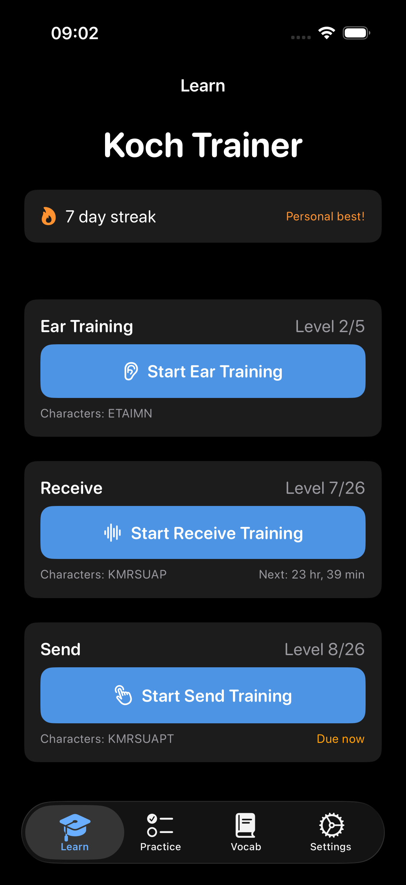
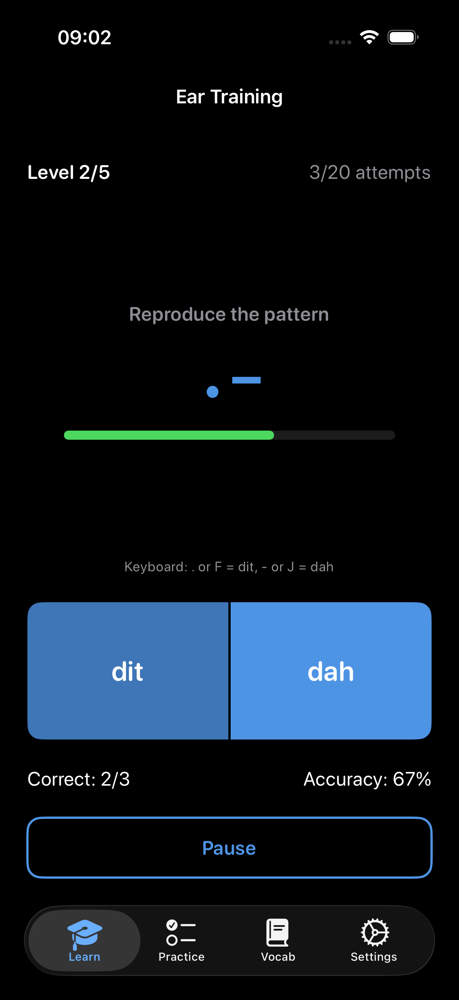
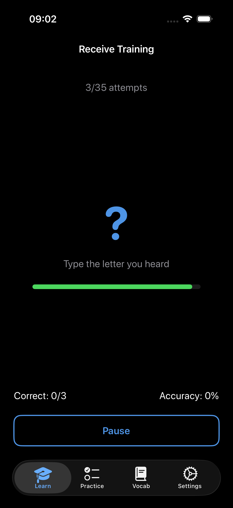
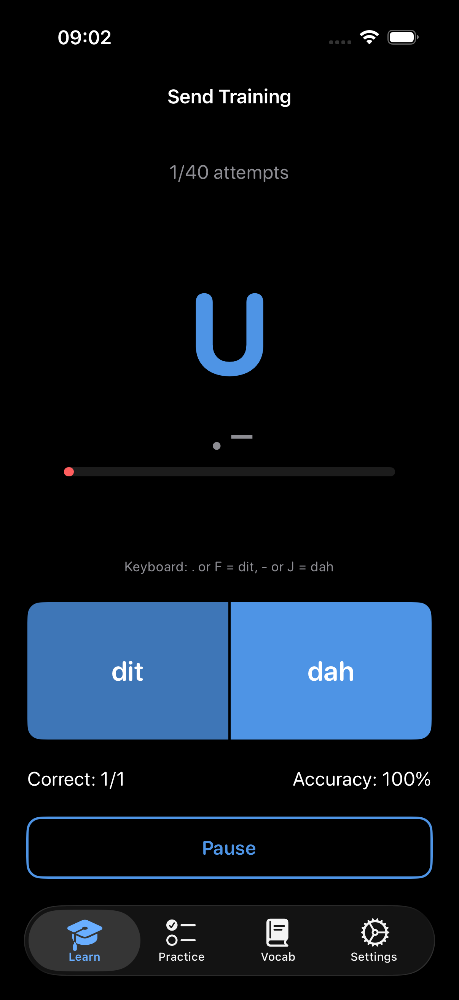
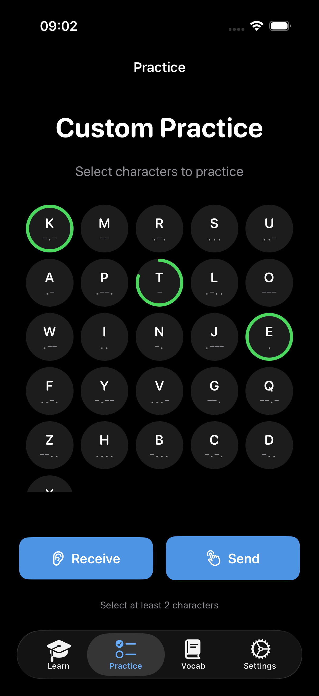
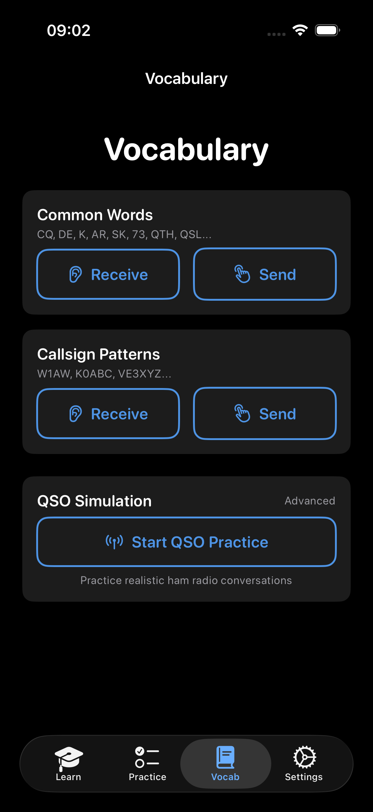
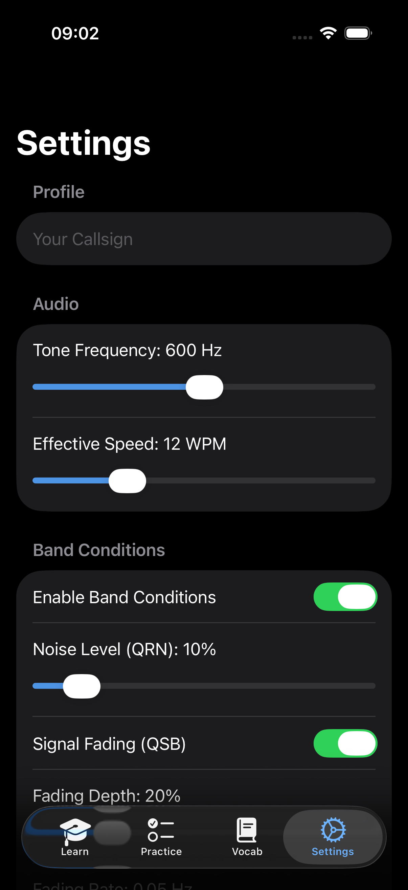

# Koch Trainer

An iOS app for learning Morse code using the Koch method—a well-established approach that teaches characters at full speed from day one.

<p align="center">
  
  
  
  
</p>
<p align="center">
  
  
  
</p>

## Features

### Learn (Koch Method)

Progressive character training following the Koch order (K M R S U A P T L O W I N J E F Y V G Q Z H B C D X).

- **Receive Training** — Listen to Morse code, type what you hear. 3-second timeout with visual countdown.
- **Send Training** — See a character, tap dit/dah buttons or use keyboard shortcuts (`.`/`F` = dit, `-`/`J` = dah) to send it.
- **Ear Training** — Hear a Morse pattern and reproduce it with dit/dah taps. Progresses by pattern length (1-5 elements), building the ear-to-hand reflex essential for sending.
- **Adaptive Difficulty** — Advance to the next character when you hit 90% accuracy over 20+ attempts
- **Separate Progression** — Track receive and send skills independently with per-character proficiency rings

### Practice (Custom Characters)

Drill specific characters you find challenging.

- Select any combination of the 26 letters
- Practice in receive or send mode
- Hear each character's sound when you select it
- Stats tracked but no level progression (won't advance you past characters you haven't learned)

### Vocabulary (Words & Callsigns)

Practice real words and callsigns used in amateur radio.

- **Built-in Sets:**
  - Common QSO words (CQ, DE, K, AR, SK, 73, RST, QTH, QSL...)
  - Sample callsign patterns (W1AW, K0ABC, VE3XYZ...)
- **Your Callsign** — Enter your callsign in Settings to practice it
- Tracks accuracy per word with weighted selection toward weak spots

### QSO Training (Conversations)

Practice realistic ham radio QSO exchanges by keying Morse code.

- **Progressive Styles:**
  - First Contact — Simple signal reports (beginner)
  - Signal Report — Reports with names
  - Contest — Fast serial number exchanges
  - Rag Chew — Full conversational QSOs
- **Two Modes:**
  - Call CQ — You call, AI responds
  - Answer CQ — AI calls, you respond
- **Features:**
  - Real-time WPM display while keying
  - Text reveal synced with audio playback
  - Hide AI text to practice copying by ear
  - Full number support (0-9) for callsigns and RST reports

### Settings

- **Your Callsign** — For personalized vocabulary and QSO practice
- **Tone Frequency** — Adjustable 400-800 Hz
- **Effective Speed** — Farnsworth spacing 10-18 WPM (character speed fixed at 20 WPM)
- **Band Conditions** — Simulate realistic HF conditions: QRN (atmospheric noise), QSB (signal fading), QRM (interference). Presets for good conditions, contest pileup, and difficult bands.
- **Notifications** — Practice-due and streak reminders. Anti-nag policy: max 2 per day, 4-hour minimum gap, quiet hours 10 PM–8 AM.
- **Session History** — Review past practice sessions and accuracy statistics

### Streaks & Spaced Repetition

- Daily streak tracking with personal best indicator
- Spaced repetition scheduling: accuracy ≥90% doubles your interval (up to 30 days), <70% resets to daily
- Practice due indicators on the home screen show when each skill needs attention
- First 14 days capped at 2-day intervals to build the practice habit

### Accessibility

Full VoiceOver support: spoken Morse patterns ("dit dah" instead of ".-"), training feedback announcements, Dynamic Type support, and accessibility hints on all interactive elements.

### Language Support

Fully localized in 6 languages:

- English (US)
- English (UK)
- German (Deutsch)
- French (Français)
- Spanish (Español)
- Italian (Italiano)

The app automatically uses your device language. All UI text, notifications, and pluralization rules are translated.

## Why This App?

The iOS App Store has several excellent Morse code apps. Here's how Koch Trainer fits in:

| App | Price | Focus | Best For |
|-----|-------|-------|----------|
| **Koch Trainer** (this app) | Free | Koch method fundamentals | Beginners learning their first 26 characters |
| [Morse Trainer Pro](https://morsetrainerpro.com/) | Freemium | Advanced training, hardware integration | Operators with Morserino/WinKeyer who want contest simulation |
| [Ham Morse](https://apps.apple.com/us/app/ham-morse/id315980140) | $4.99 | Comprehensive drills, news feeds | Active hams maintaining proficiency |
| [Morse-It](https://apps.apple.com/us/app/morse-it/id284942940) | $0.99 + IAP | Swiss-army-knife flexibility | Power users who want extensive customization |
| [Morse Mania](https://apps.apple.com/us/app/morse-mania-learn-morse-code/id1511042196) | Freemium | Gamified progression | Casual learners who enjoy game-style apps |

### Our Position

**Koch Trainer is for people who haven't yet mastered CW.** Once you've learned all 26 characters and can copy at 15+ WPM, you'll likely outgrow this app—and that's the goal. Apps like Morse Trainer Pro and Ham Morse offer advanced features (contest simulation, hardware paddles, news feeds) that make more sense once you have the fundamentals.

### What We Do Differently

- **Ear Training mode** — Inspired by language learning apps, you hear a pattern and reproduce it with dit/dah taps. This builds the ear-to-hand reflex that's essential for sending.
- **Completely free** — No ads, no subscriptions, no locked features. MIT licensed and open source.
- **Native SwiftUI** — Clean, modern iOS interface that feels at home on your device.
- **Lightweight** — ~3 MB download, no tracking SDKs, no analytics, works fully offline. Just Morse code training.
- **Focused scope** — We do one thing well: teach the Koch method for the first 26 characters.

### Respect for the Ecosystem

[Morse Trainer Pro](https://morsetrainerpro.com/) deserves special mention—it's a comprehensive platform with features we don't attempt: Morserino integration, CW Rooms for real-time practice with other operators, and contest simulation with realistic pileups. If you're serious about contesting or have hardware keyers, it's worth exploring.

[Morse Mania](https://apps.apple.com/us/app/morse-mania-learn-morse-code/id1511042196) (4.9★, 7,000+ reviews) has done excellent work making Morse code learning feel like a game. Their 270-level progression system is impressive.

[Ham Morse](https://apps.apple.com/us/app/ham-morse/id315980140) by AA9PW has been a trusted tool in the ham community for years, with thoughtful features like news feed integration and QSO simulations.

We built Koch Trainer because we wanted a simple, free, native iOS app focused purely on the Koch method fundamentals—and we think there's room for that alongside these excellent tools.

---

## The Koch Method

Traditional Morse learning starts slow and speeds up—but this creates bad habits. The Koch method, developed by German psychologist Ludwig Koch, teaches characters at full speed from the start. You learn to recognize the *sound pattern*, not count dots and dashes.

**How it works:**

1. Start with just 2 characters (K and M)
2. Practice until you hit 90% accuracy with enough attempts
3. Add one new character
4. Repeat until all 26 letters are mastered

This app implements Koch's method for both receiving (copying) and sending (keying) Morse code.

## Audio Timing

- **Character speed:** 20 WPM (60ms dit, 180ms dah)
- **Effective speed:** Adjustable 10-18 WPM via Farnsworth spacing
- **Tone:** 600 Hz default (configurable 400-800 Hz)

## Privacy

- All data stored locally on your device
- No accounts, no cloud sync, no tracking
- Notifications are local (not push)

## Requirements

- iOS 17.0 or later
- iPhone

## Building from Source

```bash
# Install XcodeGen if needed
brew install xcodegen

# Generate Xcode project and build
make generate  # Regenerate xcodeproj from project.yml
make build     # Build the app
make test      # Run all tests
```

## License

MIT License
